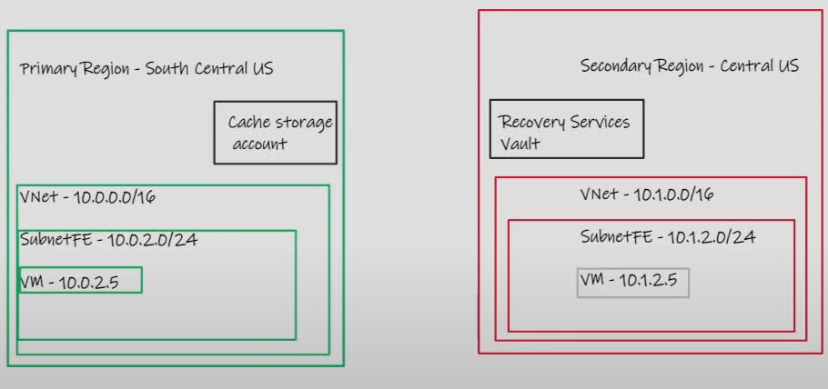
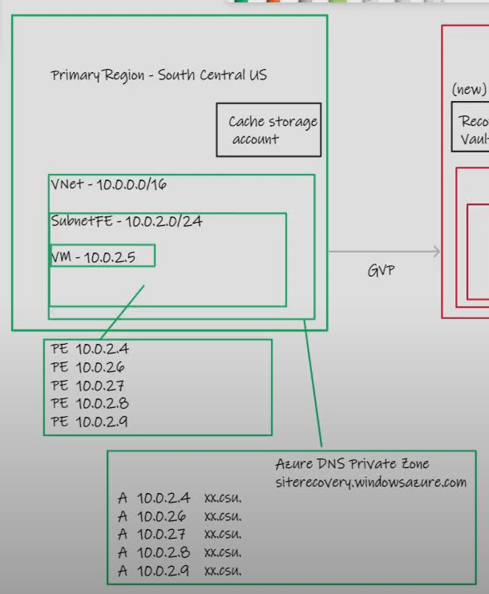
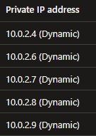
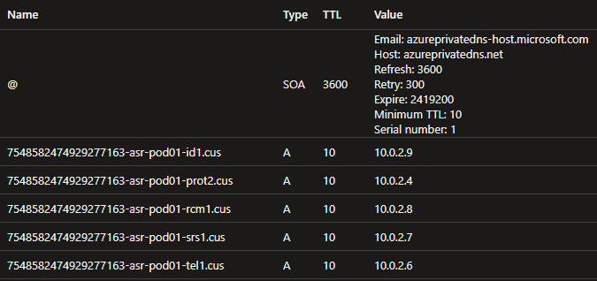
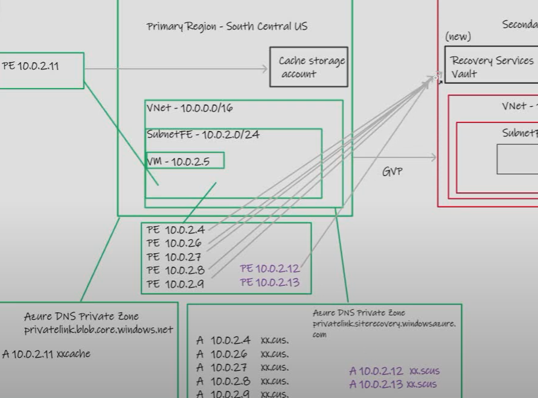
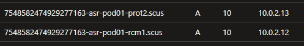
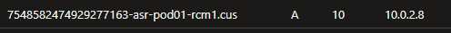
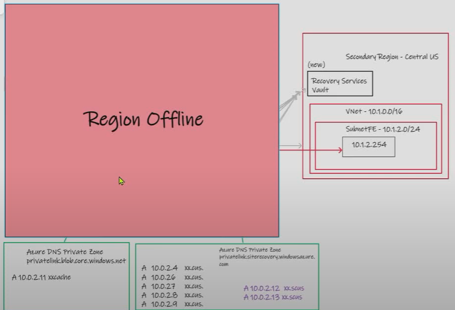
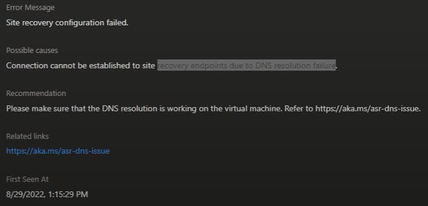
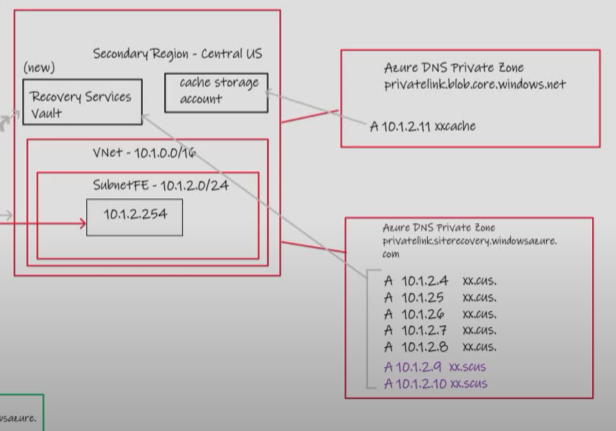

Azure Site Recovery and Azure Private Link DNS considerations
==============

# Suggested pre-reading

This article assumes familiarity with the concepts of Azure Site Recovery, Azure Private Link, DNS and general use of Azure (VNets, resources, etc), please consider the following articles  pre-reading to build foundational knowledge before jumping in.

- https://docs.microsoft.com/en-gb/azure/site-recovery/site-recovery-overview - Official MS Docs on ASR service
- https://aka.ms/whatisprivatelink - Introductory video on Private Link
- https://aka.ms/whyprivatelink - High level white paper exploring the requirement for Private Link
- https://aka.ms/privatelinkdns - Technical white paper introducing the DNS challenge when working with Private Link
- Microsoft official documentation on Private Link DNS integration, https://docs.microsoft.com/en-us/azure/private-link/private-endpoint-dns
- Daniel Mauser's excellent collection of articles related to Private link, https://github.com/dmauser/PrivateLink

# Associated video

This whitepaper can be considered the condensed focused collateral that supports the wider video hosted here - https://youtu.be/_S5dA36SgsI, it would be best to watch the video first if you did not come from there :-)

# Introduction

ASR has long been one of the most popular services used by customers on Azure, allowing them to cost-efficiently plan for BCDR events including catastrophic scenarios such as "region down". 

With the advent of Azure Private Link over the past 2-3 years, customers naturally asked the question - _Can I use Private Link to reach the components required for ASR?_. In other works, can I send the replication (and other bits and bobs) traffic from Virtual Machines that live  _in my Virtual Network_, to the Azure PaaS components (Cached Storage, Recovery Services fault) that _live outside my Virtual Network) in a more secure way.

To this end, the ASR product was integrated to use Azure Private Link and the following document was produced as a guide - https://docs.microsoft.com/en-us/azure/site-recovery/azure-to-azure-how-to-enable-replication-private-endpoints

## Vault state

As per the official doc (and my video where I missed this!) the ASR vault needs to be completely fresh I.e. **it needs to have never contained a VM, being in an empty state is not enough**

## Other pre-reqs

Complete the other pre-reqs such as sorting the vault's managed identity and adding this to the cached storage account(s)

# Enable Private Link for Azure Site Recovery

Let's use this basic diagram to have the discussion.

- Primary region in GREEN 10.0.0.0/16
- Secondary region in RED 10.1.0.0/16
- Source VM 10.0.2.5

## Vault Private Endpoint creation in primary region

When you enable a Private Endpoint for the ASR vault (target: vault, sub-resource: AzureSiteRecovery), most typically located in the RED region, the following happens.

- A Private Endpoint (PE) gets deployed in the VNet you specify, the PE NIC has one primary IP address and 4 secondary IP addresses:

- An Azure DNS Private Zone gets created (I will assume you are following the portal integrated [experience](https://docs.microsoft.com/en-us/azure/site-recovery/azure-to-azure-how-to-enable-replication-private-endpoints#:~:text=Ensure%20that%20you%20choose%20to%20create%20a%20new%20DNS%20zone), if you are using Custom DNS Servers ensure this zone is linked to the VNet where they live, and ensure they have the required conditional forwarding setup for the ASR [FQDN](https://docs.microsoft.com/en-us/azure/private-link/private-endpoint-dns#:~:text=backup.windowsazure.com-,Azure%20Site%20Recovery,-(Microsoft.RecoveryServices/vaults)). This zone maps the 5 IP addresses above, to 5 unique ASR FQDN:

> Note how the FQDN follow a [pattern](pattern) that includes ASR micro service type and Azure region geo code. 

- You need to [approve](https://docs.microsoft.com/en-us/azure/site-recovery/azure-to-azure-how-to-enable-replication-private-endpoints#approve-private-endpoints-for-site-recovery) the Private Endpoint connection on the Vault if you don't have end-to-end RBAC permissions. 

## Cached Storage Account Private Endpoint creation in primary region

In an attempt to keep this guide short, I won't cover this in detail in this whitepaper, it's covered in the video and Microsoft Docs. (It also does not have the same concerns for DNS as the Vault, because a separate cache storage account is used for re-protect operations... _read on to see why this a DNS consideration for Vault access via Private Link_)

# Replicate your Virtual Machine

When you use your shiny new Private Link enabled networking to setup your replication, you will see that two more additions are made to your Vault Private Endpoint config, as well as your Azure DNS Private Zone.

> Notice the _.scus._ Geo code, representing my RED secondary region.

During the replication, if you sniff the traffic on the source VM, you will see that mainly traffic goes to the following Vault FQDN, as well as your cached storage account.

# Region Down

Let's imagine the worse, the GREEN region has failed, and you are recovering your Virtual Machines from the Vault in your secondary region. With our config detailed above, this is successful and the VM's get re-inflated in RED.

# Re-protect DNS issues

The considerations with Azure DNS Private Zones get thrown in to focus within this stage. If we boil the problem statement down to its most salient points.

- [1] Upon re-protect, the **same** FQDN is used for ASR Vault access. (In our case a packet sniff reveals that is _7548582474929277163-asr-pod01-rcm1.cus_.

- [2] Our Virtual Machine that is trying to contact the vault, now hosted in the RED VNet, resolves this FQDN to a Public IP address, why?

  - Either

[a] **The red Virtual Network is not connected to an Azure DNS Private Zone for privatelink.siterecovery.windowsazure.com**

  - or

[b] **The red Virtual Network is connected to your GREEN Azure DNS Private Zone for privatelink.siterecovery.windowsazure.com, which has A records that point to Private Endpoint NICs that are no longer reachable**[^1]

[^1]: It's worth considering that you might not hit either of these scenarios, what is happening in your environment, is that you have deployed a single Azure DNS private zone globally for _privatelink.siterecovery.windowsazure.com_ and re-protect traffic is following the path **RED VM > ExpressRoute/Global-VNet-Peering/etc > GREEN PE > RED VAULT**. My suggestion would not be to rely on this sub-optimal network path for high-volume network replication traffic, even if it works for your topology.

- [3] Our ASR Vault blocks the public access because its only allowing connections via Azure Private Link (in the case of [a] ) or the traffic never actually gets to the Vault because of [b]

# So how do we fix this?

## Option 1 - During DR

This is the option laid out in the video, wherein during the DR event, when you deem it a suitable time to re-protect. You create new Private Endpoints and Azure DNS Private Zone for the Vault (and cached storage account) and use this to access them privately, and fail-back. 

By re-creating these resources in the RED region, you provides NICs that are local and reachable in the most optimal fashion, and have the required DNS configuration to redirect the ASR FQDN used during the re-protect operation.

## Option 2 - Ahead of time

Exactly the same as option 1, but there is nothing stopping you thinking ahead, and provisioning the RED Private Endpoints for Vault and Cached Storage ahead of time.

# Summary

When I read this article back, it all seems rather straight forward, but unpicking the behaviour and narrowing down the problem statement took some noodling, so I figured it would be good to share (and document before I forget it myself!)